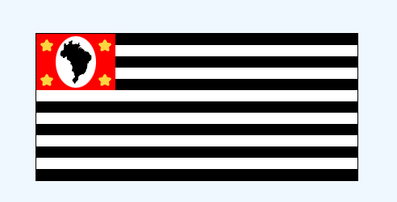

# Esse repositório tem o objetivo de alocar projetos basicos feitos em HTML E CSS.

## Tutoriais
- [APRENDA HTML](https://www.w3schools.com/html/default.asp)
- [APRENDA CSS](https://www.w3schools.com/css/default.asp)

<h1 style='text-align: center;'>Projetos</h1>

   <h2>Bandeira do estado de SP</h2>
  
 

- [Clica aqui para ver o projeto](https://romulomax47.github.io/projetos_html_css/bandeiraDoEstadoSP)

### Como contribuir
- 1° Faça um ***fork*** do repositorio. 
- 2° Feito o ***fork*** do repositório, será criado um novo repositório no seu perfil do GitHub. Faça um git ***clone*** deste na sua máquina (seu ambiente local).
- 3° Feito isso, deve-se criar uma branch para que você possa fazer as alterações/criações de código necessárias
- 4° Faça os seu projeto na pasta raiz.
- 5° Faça o push e o pull request.
  

OBS: O ***README.MD*** dever ter uma imagem do projeto e um link : ***https://romulomax47.github.io/projetos_html_css/ diretorio do seu projeto***

Se você curtiu 👍 fortalece o repositório deixa uma estrelinha. 

  <h1>Open Source</h1>
  Copyright © 2022 - <a href="https://github.com/romulomax47">iuricode</a>

